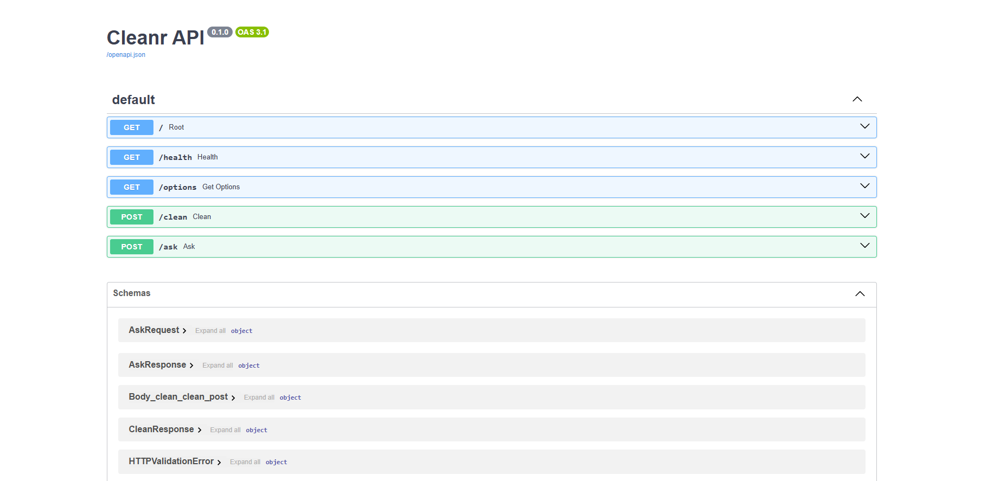

# 🧹 Cleanr

Clean messy spreadsheets and documents in the browser, then ask questions about what you uploaded.

**[Try it live →](https://file-cleanr.streamlit.app)**

Drop in a CSV full of ragged whitespace and inconsistent dates, or a PDF with mangled encoding and a header on every page. Choose what to fix, get the tidied file back in the format you want, and ask an AI agent about its contents.


---

## What it handles

| | In | Out |
|---|---|---|
| **Spreadsheets** | `.csv` `.tsv` `.xlsx` `.xls` `.json` | `.csv` `.xlsx` `.json` |
| **Documents** | `.pdf` `.docx` `.txt` `.md` | `.txt` `.md` `.docx` `.pdf` |

**Spreadsheet fixes** — trim whitespace, drop duplicate rows, normalise column names, standardise dates (with day-first/month-first detection), change text casing, handle missing values, strip currency symbols.

**Document fixes** — collapse blank lines, repair mojibake, rejoin hyphenated line breaks, strip repeated headers and footers.

Every sheet in a workbook is cleaned and preserved.


---

## Running it

Built on Python 3.14. Arabic PDFs also need [Tesseract](https://github.com/UB-Mannheim/tesseract/wiki) with the Arabic language pack.

```bash
pip install -r backend/requirements.txt -r frontend/requirements.txt
```

Add your key to `.env`:

```
ANTHROPIC_API_KEY=sk-ant-...
```

Then two terminals, both from the repo root:

```bash
uvicorn backend.main:app --reload
```

```bash
streamlit run frontend/app.py
```

The app is at `localhost:8501`, the API docs at `localhost:8000/docs`.

---

## How it works

```
Streamlit  ──HTTP──>  FastAPI  ──>  detect ──> tabular pipeline (pandas)
                                           └──> text pipeline (pymupdf / python-docx / OCR)
```

The frontend never parses a file — it posts bytes to `/clean` and renders what comes back. The backend is stateless: no sessions, no stored uploads, nothing written to disk. Everything a request needs travels with it.

`/clean` returns the cleaned file *and* a text view of it, which feeds both the preview and the agent. That's why questions work for PDFs and spreadsheets alike.

| Endpoint | Purpose |
|---|---|
| `GET /options` | The form definition — the UI is built from this |
| `POST /clean` | Upload and clean |
| `POST /ask` | Ask about a cleaned document |
| `GET /health` | Liveness |



The agent is Claude Haiku 4.5. The document is cached on the first question, so follow-ups cost about a tenth as much.

---

## Arabic PDFs

Arabic PDFs are read with OCR rather than their text layer, because that layer usually can't be trusted. Word in particular writes a character map that drops letters and reorders words — `الأمل` comes out as `المل`, `خلال` as `الل`. Every text-layer extractor reads the same broken map, so switching libraries doesn't help.

Rendering each page and reading the glyphs recovers the letters. It's slower, and it only runs when Arabic is detected, so nothing else pays for it.


---

## Tests

```bash
python -m pytest backend/tests -q
```

44 cases covering both pipelines, every output format, the error paths, and the security mitigations.

---

## Known limits

**Formatting isn't preserved.** Documents are flattened to text, so fonts, images, tables and layout are lost. You get clean *content*, not a clean *document*.

**Multi-sheet workbooks need XLSX output.** Every sheet is kept when you export to XLSX; choosing CSV or JSON is refused rather than silently dropping tabs.

**Arabic PDFs lose digits.** OCR recovers the letters a broken text layer mangles, but misreads Arabic-Indic numerals. Upload the DOCX where you can.

**Caps.** 100 MB per upload, 150 pages for OCR, 600,000 characters visible to the agent.

---

## Licence

AGPL-3.0 — see [LICENSE](LICENSE). Cleanr uses PyMuPDF, which is AGPL, so anything built on this must be too.

---

## Built with

FastAPI · Streamlit · pandas · PyMuPDF · python-docx · fpdf2 · Tesseract · Claude